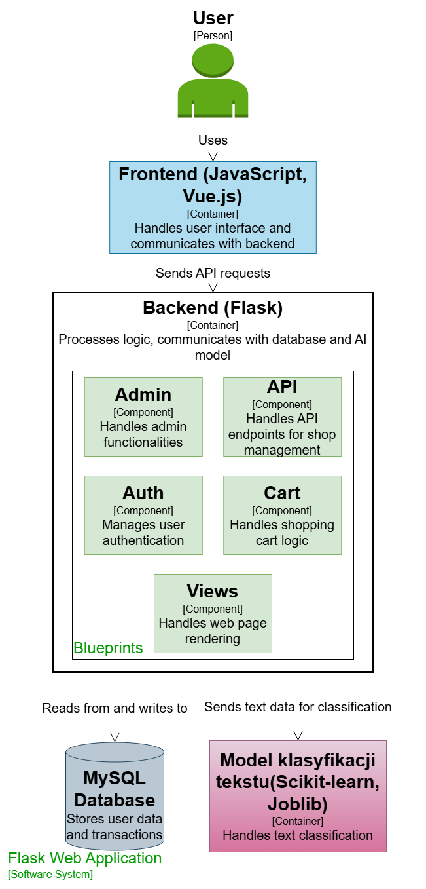
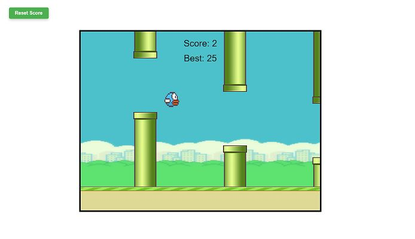

## Hi there 👋
Welcome to my GitHub profile! I'm a computer science graduate passionate about web development and machine learning.

## 🚀 Skills
- **Programming Languages:** Python, PHP, Java, JavaScript
- **Frontend Frameworks:** Vue.js
- **Databases:** MySQL
- **Machine Learning:** NLP, Classification Models

## 📂 Featured Projects

### 🛍️ [Shoop - ML-powered E-commerce](https://github.com/bartoszstec/Shoop-machine-learning)
A web-based e-commerce platform integrated with a custom-built classification model. It helps in categorizing products and enhancing user experience. 
 Tech stack: **Vue.js, Flask, and Scikit-learn**  
- Uses a **custom-trained NLP model** with **Random Forest** for sentiment analysis of customer reviews
- Developed as part of my **engineering thesis on AI-driven e-commerce solutions**  

### 🧠 Machine Learning Model
The text classification model is based on:
- **Random Forest Algorithm** – chosen for its robustness, ability to handle textual data, and ensemble-based decision-making.
- **Natural Language Processing (NLP)** using **spaCy** and the **pl_core_news_sm** language model for text tokenization, lemmatization, and linguistic analysis.
- **TF-IDF (Term Frequency-Inverse Document Frequency)** for feature extraction, converting text into numerical representations.
- **Model serialization with Joblib** for efficient loading and inference.

The model was trained on a dataset containing real-world e-commerce reviews and evaluated using a confusion matrix to assess classification accuracy.

## 🏗 System Architecture
This diagram illustrates the architecture of my engineering project:

Tech stack: Python (ML), Vue.js, PHP, MySQL

---

### 🎮 [JS FlappyBird](https://github.com/wrzoskiewicz/JS-FlappyBird)
A fun Flappy Bird clone built using JavaScript and the Canvas API

## 🎯 Interests
- Machine Learning (especially NLP & classification models)
- AI-driven applications in web development
- Full-stack development

## 🌍 Connect with me
- [LinkedIn](https://www.linkedin.com/in/bartosz-stec-17a9b4340/)

<!--
**wrzoskiewicz/wrzoskiewicz** is a ✨ _special_ ✨ repository because its `README.md` (this file) appears on your GitHub profile.

Here are some ideas to get you started:

- 🔭 I’m currently working on ...
- 🌱 I’m currently learning ...
- 👯 I’m looking to collaborate on ...
- 🤔 I’m looking for help with ...
- 💬 Ask me about ...
- 📫 How to reach me: ...
- 😄 Pronouns: ...
- ⚡ Fun fact: ...
-->
