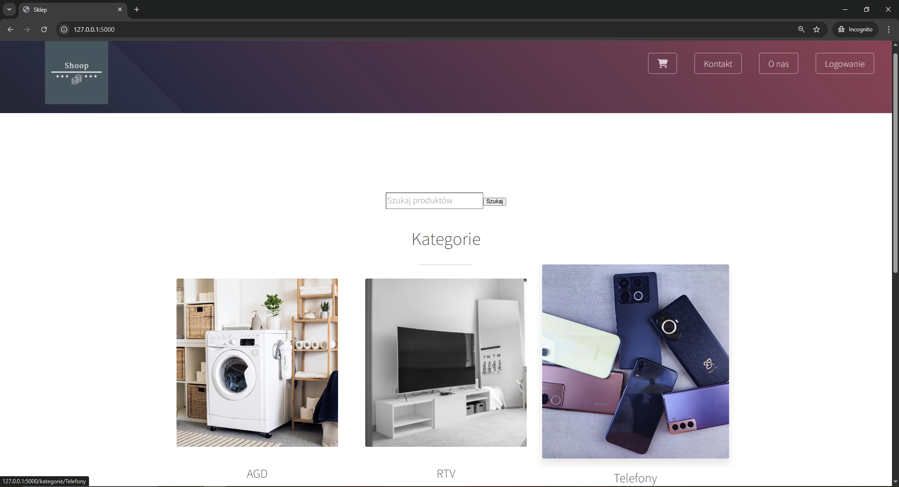
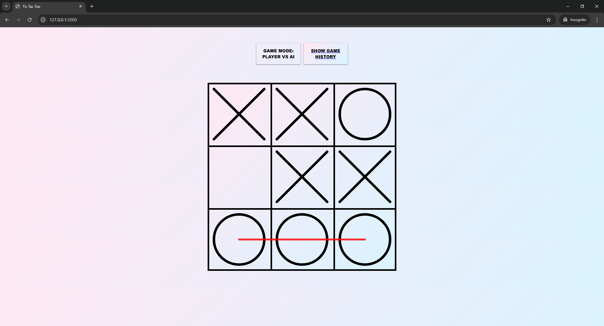

## Hi there 👋
I'm Bartosz — a Computer Science graduate (B.Eng.) and current Master's student passionate about **building AI-powered web applications**.  
I love combining machine learning with full-stack development to create projects that are both **smart** and **interactive**.  
My main goal is to develop in the field of **applied AI**.

# 📂 Latest Projects:

### 🛍️ [ecommerce-sentiment-analysis-ml-system](https://github.com/bartoszstec/ecommerce-sentiment-analysis-ml-system/tree/main)
Python | Flask | Machine Learning | Random Forest | Natural Language Processing | Sentiment Analysis | scikit-learn | spaCy | E-commerce

Web-based e-commerce platform enhanced with a custom machine learning model. Developed as my engineering thesis from scratch, the system integrates a Flask backend with a javascript frontend and employs a Scikit-learn Random Forest model trained on hybrid data. It automatically classifies user opinions as positive, negative, or neutral to improve product discovery and overall user experience.

📽️ [Demo](https://drive.google.com/file/d/1FEYMIk2cYuBNileBWR4x1U1rq4PU-IPa/view?usp=drive_link)

---

### 🎮 [rl-tic-tac-toe-dual-agent-qlearning](https://github.com/bartoszstec/tic_tac_toe)
Python | Flask | REST API | Reinforcement Learning | Q-learning | NumPy | SciPy | Data Visualization

Interactive Tic Tac Toe game featuring an AI opponent trained from scratch using Q-learning reinforcement learning. This full-stack application combines a JavaScript Canvas frontend with a Python Flask backend, where the AI learns optimal strategy through self-play. The project also includes game history tracking and training visualizations to observe the learning process.

If you are intrested in more informations about this project or want to try it out check repository link

See demo: [DEMO](https://tic-tac-toe-gze4anbeg6fkewhk.northeurope-01.azurewebsites.net/)

Screenshot gameplay:

---

### 🎮 [JS FlappyBird](https://github.com/wrzoskiewicz/JS-FlappyBird)
A browser-based Flappy Bird clone built with **JavaScript + Canvas API**.

---

### 💡 What I’m Working On
- Expanding [Shoop](https://github.com/bartoszstec/Shoop-machine-learning) in more research approach.
- Learning about role of AI in biometrics and bioinformatics. Check [repo](https://github.com/bartoszstec/diabetes_xgboost_classifier).
- Exploring cloud technologies.

## 🌍 Connect with me
- [LinkedIn](https://www.linkedin.com/in/bartosz-stec-17a9b4340/)
- Feel free to reach out to me via email: [stecbartosz.praca@gmail.com](mailto:stecbartosz.praca@gmail.com)

Open to collaborations and tech discussions! 

⚡ Fun fact: I like GYM, I can code and deadlift.
