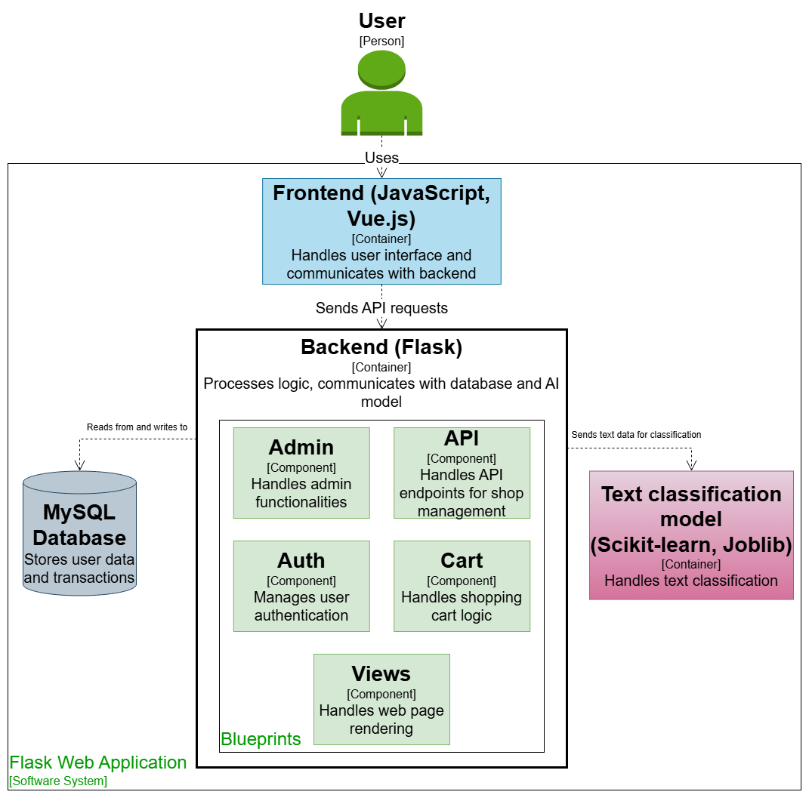

## Hi there 👋
Welcome to my GitHub profile! I'm a computer science graduate passionate about web development and machine learning.

## 🚀 Skills
- **Programming Languages:** Python, PHP, Java, JavaScript
- **Frontend Frameworks:** Vue.js
- **Databases:** MySQL
- **Machine Learning:** NLP, Classification Models

## 📂 Featured Projects

### 🛍️ [Shoop - ML-powered E-commerce](https://github.com/bartoszstec/Shoop-machine-learning)
A web-based e-commerce platform integrated with a custom-built classification model. It helps in categorizing products and enhancing user experience.
 Built with **Vue.js, Flask, and Scikit-learn**  
- Uses a **custom-trained NLP model** with **Random Forest** for automated product categorization  
- Developed as part of my **engineering thesis on AI-driven e-commerce solutions**  

### 🧠 Machine Learning Model
The text classification model is based on:
- **Random Forest Algorithm** – chosen for its robustness, ability to handle textual data, and ensemble-based decision-making.
- **Natural Language Processing (NLP)** using **spaCy** and the **pl_core_news_sm** language model for text tokenization, lemmatization, and linguistic analysis.
- **TF-IDF (Term Frequency-Inverse Document Frequency)** for feature extraction, converting text into numerical representations.
- **Model serialization with Joblib** for efficient loading and inference.

The model was trained on **partly real-world e-commerce data** and tested using **confusion matrices** to evaluate classification performance.

## 🏗 System Architecture
This diagram illustrates the architecture of my engineering project:

Tech stack: Python (ML), Vue.js, PHP, MySQL

------------------------------------------------------------------------

### 🎮 [JS FlappyBird](https://github.com/wrzoskiewicz/JS-FlappyBird)
A fun Flappy Bird clone built using JavaScript with canvas object

## 🎯 Interests
- Machine Learning (especially NLP & classification models)
- AI-driven applications in web development
- Full-stack development

## 🌍 Connect with me
- [LinkedIn](https://linkedin.com/in/)
- [Portfolio](https://yourportfolio.com) *(if you have one, warto dodać!)*
- [Twitter](https://twitter.com/) *(jeśli używasz do techowych tematów)*

<!--
**wrzoskiewicz/wrzoskiewicz** is a ✨ _special_ ✨ repository because its `README.md` (this file) appears on your GitHub profile.

Here are some ideas to get you started:

- 🔭 I’m currently working on ...
- 🌱 I’m currently learning ...
- 👯 I’m looking to collaborate on ...
- 🤔 I’m looking for help with ...
- 💬 Ask me about ...
- 📫 How to reach me: ...
- 😄 Pronouns: ...
- ⚡ Fun fact: ...
-->
